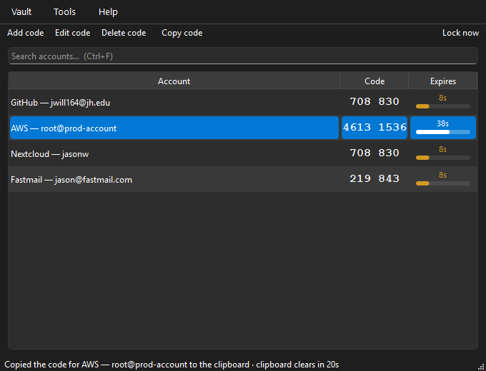
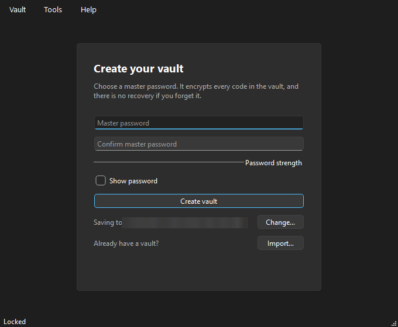
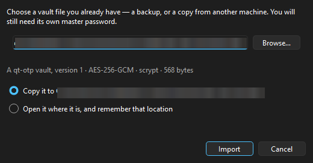
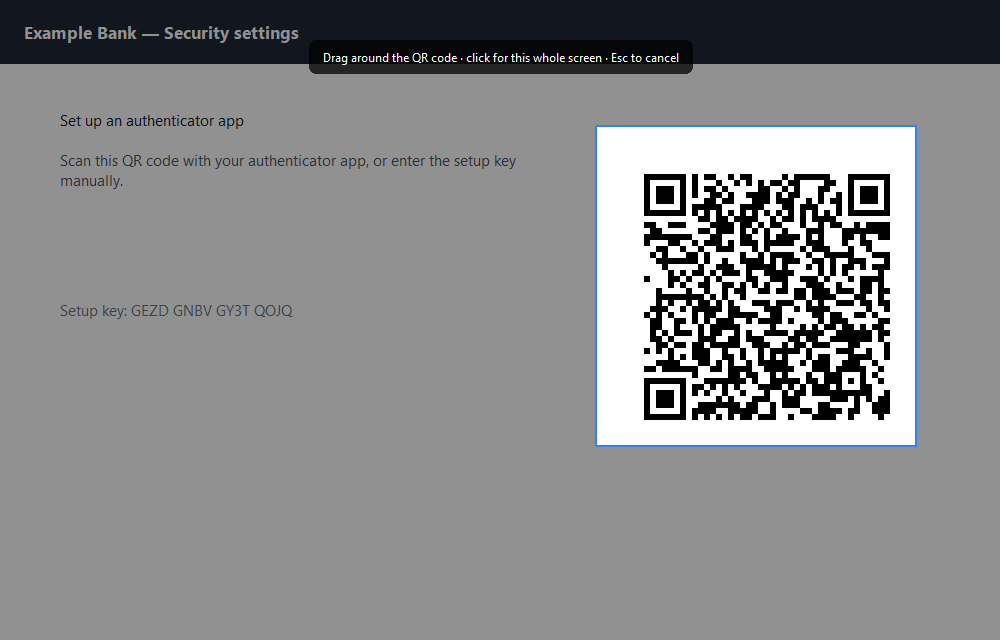

# qt-otp

A Qt desktop app that holds your TOTP (authenticator) codes in a single
password-encrypted file, shows the live 6/8-digit codes, and locks itself the
moment you lock your workstation.



## What it does

- **Many accounts, one file.** Add codes by scanning the QR code off your
  screen, by pasting an `otpauth://totp/...` URI, or by hand. Issuer, account,
  algorithm (SHA1/SHA256/SHA512), digit count (6/7/8) and period are all
  per-entry. See [Adding an account by QR code](#adding-an-account-by-qr-code).
- **Encrypted at rest.** The vault is AES-256-GCM; the key comes from your
  master password via scrypt (N=32768, r=8, p=1). The KDF header is
  authenticated, so nobody can edit the file to weaken the cost parameters.
  Nothing is written in the clear — not even issuer names.
- **Password at startup.** The app opens on an unlock screen. Wrong guesses are
  slowed down after three tries.
- **Bring an existing vault with you.** The first-run screen can import a vault
  you already have — from a backup, or from another machine — either copying it
  into place or opening it where it lies. See
  [Importing an existing vault](#importing-an-existing-vault).
- **You choose where the vault lives.** The create screen on first run offers the
  location before anything is written, and Tools → Settings can change it later,
  which moves the existing vault file to the new place. See
  [Where the vault lives](#where-the-vault-lives).
- **Locks when you walk away.** See [Locking](#locking).
- **One window per vault.** Launching it again while it is already running
  brings the existing window to the front instead of opening a second copy —
  including when it was sitting in the tray. See
  [One instance per vault](#one-instance-per-vault).
- **Live codes.** Each row shows the current code and a countdown bar; the code
  turns amber under 10 s and red under 5 s.
- **Right-click to fill it in for you.** Optional, off by default: a right-click
  copies the code, hands focus back to the window you came from, pastes it and
  presses Enter. See [Right-click auto-paste](#right-click-auto-paste).
- **Click to copy.** Clicking anywhere on a row copies that row's code, and the
  status bar confirms it: `Copied the code for GitHub — you@example.com to the
  clipboard · clipboard clears in 20s`. The clipboard self-clears after 20 s
  (configurable), and clears immediately when the vault locks.

## Locking

The vault re-locks — dropping the key and every plaintext secret out of memory —
on any of these:

| Trigger | How it is detected |
| --- | --- |
| You lock your workstation (Win+L, screensaver, RDP disconnect, switch user) | Windows: a message-only window subscribed to WTS session notifications (`WM_WTSSESSION_CHANGE`). Linux: `org.freedesktop.login1` `Lock`/`Unlock` and the screensaver's `ActiveChanged` over DBus. |
| The machine goes to sleep | `WM_POWERBROADCAST` / `PrepareForSleep` |
| No keyboard or mouse activity for 5 min (configurable) | `GetLastInputInfo` on Windows — system-wide, not just this app — falling back to in-app activity elsewhere |
| The window is minimized | optional, off by default |
| You press Ctrl+L, or quit | — |

macOS has no native hook here, so it relies on the inactivity timer. The status
bar tells you which detector is active, and Tools → Settings turns each one off.

The window, taskbar and tray icon greys out while the vault is locked, so the
lock state is readable without switching to the app.

## Install and run

Every [release](../../releases/latest) ships the same application two ways: an
installer and a portable `.exe`. Neither is code-signed, so SmartScreen will
warn on first run — **More info** then **Run anyway**. Both carry a `.sha256`
sidecar if you would rather verify the download:

```powershell
(Get-FileHash .\qt-otp-v1.0-windows-x64-setup.exe -Algorithm SHA256).Hash
```

### Windows: the installer

`qt-otp-vX.X-windows-x64-setup.exe` installs to `%LOCALAPPDATA%\Programs\qt-otp`
for you alone, which needs no administrator; choose **All users** on the first
page to put it in `Program Files` instead. You get a Start menu shortcut
(desktop shortcut optional) and an entry in Apps & features.

The installer never touches your vault. Installing over an existing copy
upgrades it in place, and uninstalling leaves `%APPDATA%\qt-otp` alone unless
you answer yes to a prompt that says so in as many words.

It takes the usual NSIS switches, so it scripts cleanly:

```powershell
.\qt-otp-v1.0-windows-x64-setup.exe /S /CurrentUser        # silent, per-user
.\qt-otp-v1.0-windows-x64-setup.exe /S /AllUsers /D=C:\Apps\qt-otp
```

`/D=` must come last and must not be quoted — that is NSIS, not a typo. A
silent uninstall (`QuietUninstallString` in the registry) always keeps your
vault, since there is nobody there to ask.

### Windows: just the .exe

Prefer no installer at all? Grab `qt-otp-vX.X-windows-x64.exe` and run it. One
self-contained file (~47 MB), nothing written outside your vault directory, and
it keeps that vault in the same place as every other install.

### From source

Needs 64-bit Python 3.10+ (PySide6 publishes no 32-bit Windows wheels).

```powershell
& "C:\Program Files\Python313\python.exe" -m venv .venv
.\.venv\Scripts\python.exe -m pip install -e ".[dev]"
.\.venv\Scripts\python.exe -m otpvault
```

Or just `.\run.ps1`, which does the same thing and reuses the venv.

```text
python -m otpvault [--vault PATH] [--verbose]
```

## Where the vault lives

By default the vault is `%APPDATA%\qt-otp\vault.otpv` on Windows
(`~/.local/share/qt-otp/vault.otpv` on Linux, `~/Library/Application Support` on
macOS). Three ways to put it somewhere else:



1. **On first run**, the create screen shows where the vault is about to be
   written, with a **Change…** button. Nothing is written until you set the
   password, so choosing a location costs nothing.
2. **Later**, Tools → Settings → *Vault file*. Changing it **moves the existing
   vault file** to the new location and remembers it; the open session keeps
   working and the next save goes to the new path. If a file is already there you
   are warned before anything is replaced, and a failed move leaves the vault
   exactly where it was.
3. **For one run only**, `--vault PATH`. That overrides the saved location
   without changing it, and the Settings row is disabled for that run.

Preferences themselves live in the registry on Windows (`QSettings`). Set
`QT_OTP_SETTINGS_FILE` to an `.ini` path to keep them in a file instead, which
is what you want for a portable install on a USB stick alongside the vault.

A synced folder (Nextcloud, Dropbox) works — the file is encrypted and safe to
sync — but avoid writing to it from two machines at once.

## Importing an existing vault

If you already have a vault — a backup, or a copy from another machine — the
first-run screen has an **Import…** button next to *Already have a vault?*



The file is checked before anything happens: its header says whether it really
is a qt-otp vault, and the dialog reports what it found (`version 1 ·
AES-256-GCM · scrypt`) or why the file is unusable. Import stays disabled until
a valid vault is selected, so a wrong file cannot be copied into place.

Then pick what should happen to it:

- **Copy it to ‹the configured location›** — for a backup or a file you were
  sent. The original is left exactly where it was, and the copy is written
  through a temporary file so a half-copied vault never appears.
- **Open it where it is** — for a vault in a synced folder. Nothing is copied or
  moved, and the location is remembered for next time.

Either way the vault keeps the master password it already had; qt-otp cannot
read it until you type that password. Nothing about the import touches the
entries themselves — it is the same encrypted file, byte for byte.

Once a vault exists the offer disappears, because there is nothing to import
*into*. Note what Tools → Settings does instead: it **moves the vault you
already have** to a new location, which is a different job from adopting a
second vault. To switch to a different existing vault, move your current one out
of the way first (or export a backup and point a fresh location at it).

## Adding an account by QR code

Every service that gives you a setup key also shows a QR code containing the
same thing. **Vault → Add by scanning a QR code…** (Ctrl+Shift+N) reads it off
the screen instead of making you type the key.



The window gets out of the way, each screen freezes, and you drag a box around
the code — or click once to use that whole screen. Esc or a right-click cancels.
What is captured is the frozen pixels from the moment you asked, at full device
resolution: a QR code needs every pixel it has, so nothing is scaled down.

What happens next depends on what was in the box:

- **One account** opens the Add dialog with the issuer, account, algorithm,
  digits and period already filled in, so you can check it (and rename it)
  before saving.
- **Several accounts** — a page listing more than one code — are listed for
  confirmation and then added together.
- **No readable code** says so, including how big the area you selected was. QR
  codes need a little room: include a margin, and zoom the page in if the code
  is displayed small. A code shrunk below roughly two pixels per module cannot
  be read by anything.
- **A Google Authenticator batch export** (`otpauth-migration://`) is
  recognised and explained rather than reported as "nothing found": it is a
  protobuf blob this app does not read, so export the per-account codes
  instead.
- **A QR code that is not an account** — a URL, a wifi code — is ignored.

Decoding is [zxing-cpp](https://pypi.org/project/zxing-cpp/); it is a hard
dependency but the app degrades to manual entry if it is ever missing, with the
menu item disabled and the reason in its tooltip.

## Right-click auto-paste

Turn on *Right-click a row to paste the code into the previous window and press
Enter* in Tools → Settings and a right-click will:

1. copy the code, as a left-click does;
2. give the foreground back to the window that had it before you switched to
   qt-otp;
3. send Ctrl+V to it, once the foreground has actually moved;
4. press Enter a moment later, to submit it.

The status bar then says what happened and where — `Pasted the code for GitHub —
you@example.com into Some App and pressed Enter` — because that is the one thing
worth being sure about.

**It types into, and submits, whatever window it hands focus to.** That window is
the last one that was in front before you came to qt-otp, which is usually the
login form you were filling in — but it is not guaranteed to be. Leave qt-otp
open for an hour, click around elsewhere, and the remembered window may not be
the one you have in mind; with Enter in the sequence, the code is not just typed
somewhere unintended but sent. The status bar names the target, and the feature
is off by default, precisely because it reaches outside the app.

Each step is separate on purpose:

- Enter is only sent if the paste itself succeeded — submitting a form that never
  received the code would be worse than not submitting at all;
- there is a short gap between them, so a field that reformats or validates what
  it just received has finished before the form goes;
- locking the vault or closing the window cancels anything still pending, so no
  keystroke can arrive after you have walked away.

Details:

- Windows only. The checkbox is disabled elsewhere; the rest of the app is
  unaffected.
- The foreground window is sampled on a timer, because by the time qt-otp knows
  it has been activated the window you came from is no longer the front one.
  Sampling only runs while the vault is unlocked *and* the setting is on, and
  the remembered window is forgotten when the vault locks.
- Our own windows are never targets, nor is a window that has since closed. With
  no usable target, a right-click just copies and says so.
- The context menu (Copy, Copy URI, Edit, Delete) stays available on **Shift+F10**
  or the menu key, which is unaffected by this setting.

## One instance per vault

Starting the app a second time on the same vault does not open a second window:
the new process finds the running one over a local socket (a named pipe on
Windows), asks it to come forward, and exits. The existing window is unminimized
and focused, and if it was hidden in the tray it reappears — with the password
field focused when the vault is locked.

Two *different* vaults can still be open at once. That is the useful case, and
keying on the vault path also blocks the harmful one: two copies of the same
vault each hold every entry in memory and each save rewrites the whole file, so
the second one to save would quietly discard the other's changes.

Details worth knowing:

- The lock is per user as well as per vault, and the socket name is a hash, so
  nothing about your paths is exposed in a namespace other sessions can read.
- A socket left behind by a crash is cleaned up and taken over rather than
  locking you out.
- If something holds the vault open but never answers, the new launch says so
  instead of doing nothing.
- `--vault` selects which lock applies, so `--vault other.otpv` opens a second
  window quite happily.

## Keyboard

| Key | Action |
| --- | --- |
| `Ctrl+N` | Add code |
| `Ctrl+Shift+N` | Add by scanning a QR code on screen |
| `Ctrl+E` | Edit selected code |
| `Del` | Delete selected code |
| `Ctrl+C` / `Enter` | Copy the selected code (or just click the row) |
| `Shift+F10` | Context menu (always, even with auto-paste on) |
| `Ctrl+F` | Search |
| `Ctrl+L` | Lock now |
| `Ctrl+Q` | Quit |

## Backups

`Vault → Export encrypted backup…` copies the encrypted file as-is, so the copy
needs the same master password. To restore one, point a fresh install at it with
[Import…](#importing-an-existing-vault) on the first-run screen.

**There is no password recovery.** If you forget the master password the codes
are gone — keep each service's recovery codes somewhere else.

## Layout

```text
otpvault/
  totp.py       RFC 4226/6238 HOTP+TOTP and otpauth:// URIs (stdlib only)
  crypto.py     scrypt + AES-256-GCM envelope, authenticated header
  vault.py      entries, unlock/lock lifecycle, atomic writes
  lockwatch.py  session-lock / sleep / idle detection per platform
  config.py     QSettings-backed preferences (nothing sensitive)
  singleinstance.py  one copy per vault, and the focus handoff
  qrscan.py     reads otpauth:// URIs out of screen pixels
  autopaste.py  foreground tracking and the Ctrl+V handoff (Windows)
  ui/           unlock screen, code table, dialogs, icons, screen-region picker
  resources/    qt-otp-icon.svg, rendered per size for the window, taskbar and tray
  selftest.py   post-build checks, run with --selftest
tests/          RFC 6238 vectors, crypto tamper cases, vault lifecycle
tools/          make_icon.py (SVG -> .ico), entrypoint.py (PyInstaller script)
installer/      qt-otp.nsi, the NSIS installer that wraps the built .exe
qt-otp.spec     PyInstaller build definition
```

## Building the executable

```powershell
.\.venv\Scripts\python.exe -m pip install -e ".[dev,build]"
.\.venv\Scripts\python.exe tools\make_icon.py          # build\qt-otp.ico from the SVG
.\.venv\Scripts\python.exe -m PyInstaller --noconfirm --clean qt-otp.spec
```

That writes `dist\qt-otp.exe`: windowed, single file, UPX off (it saves a few
MB and reliably trips antivirus heuristics). The `.ico` is generated from
`qt-otp-icon.svg` by the same code path the app uses for its window icon, so the
two cannot drift apart.

Freezing breaks things that pass in a checkout — the OpenSSL backend behind
scrypt, bundled data files, Qt plugins, ctypes DLL lookups — so the build has a
self-check:

```powershell
.\dist\qt-otp.exe --selftest report.json | Out-Host
```

It exercises the real machinery (scrypt round-trip, SVG rendering, the
session-lock watcher, opening the main window) and exits non-zero if anything is
wrong. Onefile builds extract to a temp directory on launch, so first start
takes a second or two.

The pipe is load-bearing: PowerShell does not wait for GUI-subsystem
executables, so without it the checks print after your next prompt and
`$LASTEXITCODE` belongs to the previous command. In a script, use
`Start-Process -Wait -PassThru` and read its `ExitCode` — which is what the
release workflow does.

## Building the installer

[`installer/qt-otp.nsi`](installer/qt-otp.nsi) wraps `dist\qt-otp.exe` — build
that first. Needs [NSIS](https://nsis.sourceforge.io/) 3.x; the version number
is the only argument it insists on:

```powershell
& "C:\Program Files (x86)\NSIS\makensis.exe" /DVERSION=1.4.0 installer\qt-otp.nsi
```

That writes `dist\qt-otp-setup.exe`. `SRC_EXE`, `ICON`, `LICENSE_FILE` and
`OUT_FILE` are `/D`-overridable too, which is how the workflow points them at
absolute paths.

There is deliberately nothing in the installer but the one executable, its
shortcuts and an uninstaller. It writes no file associations, no autostart entry
and no `HKLM` state a per-user install could not manage — the app's own data
(`%APPDATA%\qt-otp` and `HKCU\Software\qt-otp`) is created by the app and
removed only if you ask the uninstaller to.

Two details worth knowing before editing it:

- NSIS's `MultiUser.nsh` assigns `$INSTDIR` inside `MULTIUSER_INIT`, which would
  otherwise discard a `/D=` path. `.onInit` saves and restores it.
- The installer is a 32-bit process, so it runs `SetRegView 64`; without that
  every `HKLM` write would land in `Wow6432Node`, where Apps & features does not
  look.

## Releasing

1. Bump `__version__` in [`otpvault/__init__.py`](otpvault/__init__.py) — the
   only place a version number lives; `pyproject.toml` reads it from there.
2. Tag and push:

   ```powershell
   git tag v1.1
   git push origin v1.1
   ```

[`.github/workflows/release.yml`](.github/workflows/release.yml) then runs on a
Windows runner: it refuses tags that disagree with `__version__`, runs the test
suite, builds the exe, smoke-tests it with `--selftest`, builds the NSIS
installer around it, and publishes a release with both files and their SHA-256s.
Re-running a tag replaces the assets instead of failing. `workflow_dispatch`
builds without releasing, if you want to rehearse.

The installer gets its own smoke test before anything is published: the workflow
installs it silently, runs `--selftest` from the *installed* copy — which proves
NSIS round-tripped the executable intact — then uninstalls silently and checks
that the files and the Apps & features entry are gone.

The trigger is the `vX.X` shape (`v1.0`, `v2.11`). To release patch tags too,
add `'v[0-9]+.[0-9]+.[0-9]+'` to the `tags:` list.

## Tests

```powershell
.\.venv\Scripts\python.exe -m pytest -q
```

263 tests plus one that needs a real desktop, no display required for the rest (Qt runs offscreen):

- the full RFC 6238 vector table for all three hash algorithms, plus URI parsing;
- wrong-password, tampered-ciphertext and KDF-downgrade rejection;
- the vault's create/lock/unlock/rekey behaviour, including that locking really
  does blank the secrets the UI was holding;
- the auto-lock triggers — the Windows cases post the same
  `WM_WTSSESSION_CHANGE` / `WM_POWERBROADCAST` messages the OS sends on Win+L
  into the real message-only window, so the whole path is covered;
- the main window end to end: create, render codes, click-to-copy, search, lock,
  retry with a wrong password, re-unlock;
- the icon: that the SVG ships inside the package, renders at every size, and
  that the locked variant is a desaturated version of the same artwork;
- QR scanning: codes read off a rendered page, from a crop, several at once,
  a non-account code ignored, a Google Authenticator export told apart, and the
  point at which a shrunken code stops being readable; plus the region picker's
  geometry, including that the captured pixels are exactly the un-dimmed
  selection and that a scaled display captures real pixels;
- right-click auto-paste: the foreground-tracking rules, that the paste waits
  for focus to move and Enter waits for the paste, that Enter never follows a
  failed paste, that locking or closing cancels a pending keystroke, that a
  missing target degrades to copy-only, and that the keyboard context menu
  still works;
- importing: that a real vault is described and adopted, a wrong file is refused
  before anything is written, the source is never consumed, and the
  single-instance guard follows the vault to its new path;
- the vault location: moving a live vault, refusing to clobber another file
  without confirmation, keeping the old path when a move fails, and never
  persisting a `--vault` override;
- the release pipeline: that the workflow still triggers on `vX.X`, tests before
  it publishes, smoke-tests the executable, and references files that exist;
- single-instance behaviour, including four tests that launch the app twice as
  real processes and check the second one hands over and exits — the request and
  reply cannot be exercised inside one process, because two ends of the same
  pipe interfere there.

## License

Apache License 2.0 — see [LICENSE](LICENSE).

## Security notes, honestly

- While unlocked, secrets are plaintext in the process's memory — as they must
  be to compute codes. Python strings can't be reliably wiped; locking clears
  the key buffer and drops the entry objects' secrets, which is the practical
  limit. Locking often is the real defense.
- The vault file's confidentiality rests entirely on your master password.
  scrypt at 32 MiB makes guessing expensive, not impossible: use a long
  passphrase.
- No process-memory hardening, no anti-screenshot tricks, no protection against
  someone with code execution as your user. It defends a stolen file and an
  unattended screen, not a compromised account.
